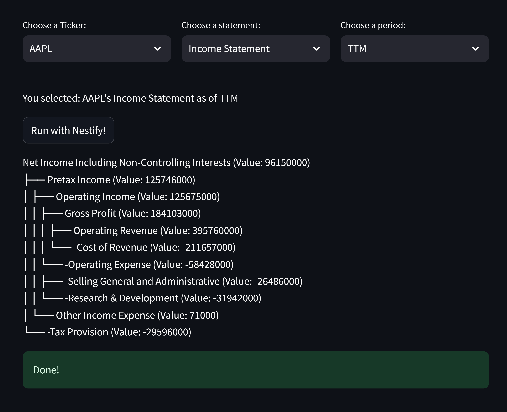

# NestifyFinance

Visit my website: http://103.6.169.213:8501/
(There is no need to upload any data for this being unsecured webpage.)

## Inspiration and Motivation

## Benefit
   * 100% data accuracy by multiple-level checks such as all statements must be balanced; all totals and subtotals can be broken down into their components 
    
## Data source:
   1. The backend process starts by pulling the data table real-time from online media upon user click "Run with Nestify". 
   2. All data tables are initially flattened. 
   3. The process then constructs tree and graph data structures with all children nodes summing to parent nodes. 

## Here's a step-by-step guide:

**Step 1:**
    * Select from the drop-down lists of ticker, report, and period

**Step 2:**
    * Click on the icon "Run with Nestify" and wait for the system to process the data (up to 2 minutes). 

**Step 3:**
    * View the structured and verified financial data.

## Future work

* Develop an external API to enable users to upload their own financial data from various sources (e.g., CSV files, spreadsheets).
* Expand support for a wider range of financial report formats and data sources.
* Improve processing speed.
